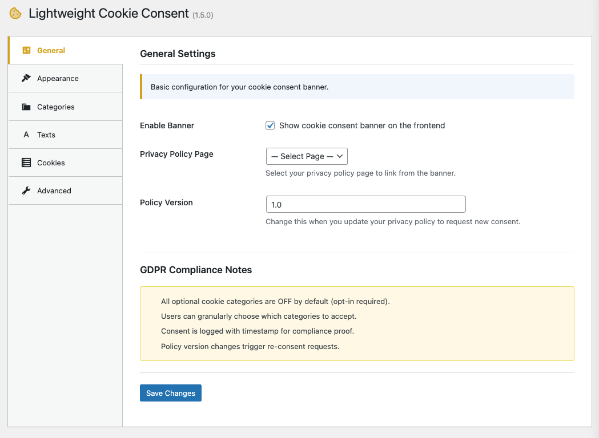

# LW Cookie

GDPR-compliant cookie consent banner for WordPress - minimal footprint, full compliance.

[](https://php.net)
[](https://wordpress.org)
[](https://www.gnu.org/licenses/gpl-2.0.html)



## Features

### GDPR Compliance

- **Opt-in by default** - All optional categories are OFF until user consents
- **Granular category selection** - Necessary, Functional, Analytics, Marketing
- **Consent logging** - Timestamp and policy version for compliance proof
- **Policy version tracking** - Automatic re-consent on policy changes
- **Anonymized IP logging** - GDPR-compliant data storage

### Cookie Banner

- Customizable position (top, bottom, modal)
- Customizable layout (full-width bar, floating box)
- Customizable colors and border radius
- Accept All / Reject All / Customize buttons
- Floating button for easy access to preferences

### Script Blocking

Automatic blocking of known tracking scripts until consent:

- Google Analytics / Google Tag Manager
- Facebook Pixel
- Hotjar
- LinkedIn Insight Tag
- Twitter/X Pixel
- TikTok Pixel
- Microsoft Clarity
- Pinterest Tag
- Snapchat Pixel

Can be switched off under **Advanced → Script Blocking**. The known tracking cookies (`_ga`, `_fbp`, …) still wait for consent either way.

### Content Blocking

Block third-party embeds until consent is given:

- YouTube videos
- Vimeo videos
- Google Maps
- Other known embed hosts (Dailymotion, Twitch, SoundCloud, Spotify, …)

### Cookie Scanner

Detect cookies on your website:

- Server-side scanning (detects HttpOnly cookies)
- Deep scan with remote headless browser
- Cookie Database API integration (2000+ known cookies)
- Automatic cookie enrichment with provider, purpose, duration

### Google Consent Mode v2

- Built-in support for Google Consent Mode v2
- Loads at highest priority (before any tracking script)
- EEA region-specific defaults
- Required for Google Ads and Analytics in the EU
- Automatic consent signal updates

### Meta Pixel (Facebook) Support

- Automatic `fbq('consent', 'revoke/grant')` API calls
- Works with existing Facebook Pixel implementations

### Third-Party Plugin Integration

- **dataLayer.push** events for GTM triggers (`lw_cookie_consent_update`)
- **WordPress filters** for querying consent state

### WP-CLI Support

Full command-line management:

```bash
wp lw-cookie settings list              # List all settings
wp lw-cookie settings set enabled true  # Change settings
wp lw-cookie stats                      # View consent statistics
wp lw-cookie export --format=csv        # Export consent logs
wp lw-cookie clear-logs --older-than=365 # Clean up old logs
```

## Installation

### Via Composer (Recommended)

```bash
composer require lwplugins/lw-cookie
```

### Manual Installation

1. Download the latest release
2. Upload the `lw-cookie` folder to `/wp-content/plugins/`
3. Activate the plugin through the 'Plugins' menu
4. Go to **LW Plugins → Cookie** to configure

## Configuration

Navigate to **LW Plugins → Cookie** in your WordPress admin to access settings:

| Tab | Description |
|-----|-------------|
| **General** | Enable/disable, privacy policy page, policy version |
| **Appearance** | Position, layout, colors, border radius |
| **Categories** | Customize category names and descriptions |
| **Texts** | Banner title, message, and button labels |
| **Advanced** | Consent duration, script blocking, Google Consent Mode |

## Cookie Categories

| Category | Required | Description |
|----------|----------|-------------|
| **Necessary** | Yes | Essential cookies for website function |
| **Functional** | No | Enhanced functionality and personalization |
| **Analytics** | No | Visitor analytics and statistics |
| **Marketing** | No | Advertising and remarketing |

## JavaScript API

```javascript
// Accept all cookies
LWCookie.acceptAll();

// Reject all optional cookies
LWCookie.rejectAll();

// Open preferences modal
LWCookie.openPreferences();

// Accept a single category (e.g. from an embed placeholder button)
LWCookie.acceptCategory('marketing');

// Get current consent state
const consent = LWCookie.getConsent();
// { necessary: true, functional: false, analytics: false, marketing: false }

// Check if category is allowed
if (LWCookie.isAllowed('analytics')) {
    // Load analytics scripts
}

// Listen for consent changes
window.addEventListener('lwCookieConsent', function(e) {
    console.log('Categories:', e.detail.categories);
    console.log('Action:', e.detail.action);
});

// Delete all cookies (for "forget me" functionality)
LWCookie.deleteAllCookies();
```

## WordPress Hooks (PHP)

For third-party plugin integration:

```php
// Get all consent categories
$categories = apply_filters( 'lw_cookie_consent_categories', [] );
// ['necessary' => true, 'functional' => false, 'analytics' => true, 'marketing' => false]

// Check if user has given any consent
$has_consent = apply_filters( 'lw_cookie_has_consent', false );

// Check if specific category is allowed
$analytics_ok = apply_filters( 'lw_cookie_is_category_allowed', false, 'analytics' );
```

## Integrating Custom Embeds

While **Advanced → Content Blocking** is on (the default), the guard blocks iframes from known embed hosts (YouTube, Vimeo, Google Maps, …) until the visitor accepts the cookie category of their host, and shows a placeholder in their place. A plugin or theme that renders embeds can send them in that blocked form itself. Nothing is then requested from the host before consent. When the guard blocks an iframe it finds in the page, the iframe has already sent its request.

```html
<div class="lw-cookie-embed-block my-player__consent"><p class="lw-cookie-embed-block__msg">To watch this video, accept the required cookies.</p><button type="button" class="lw-cookie-embed-block__btn" data-my-category="marketing">Accept &amp; play video</button></div><iframe data-lw-blocked="1" data-lw-category="marketing" data-lw-original-src="https://player.vimeo.com/video/76979871" style="display:none"></iframe>
```

The contract:

- **The iframe** has no `src`. It carries `data-lw-blocked="1"`, `data-lw-category` (`functional`, `analytics` or `marketing`) and `data-lw-original-src` (the URL to load once allowed).
- **The placeholder** is an element with the `lw-cookie-embed-block` class that is the iframe's previous sibling *node*: no whitespace in between. LW Cookie styles it and its `__msg` / `__btn` children. In a padding-ratio box, position it over the box yourself (`position:absolute; inset:0; min-height:0`).
- **When consent for the category is saved** (banner, preferences, or `acceptCategory()` below), the guard sets `src` from `data-lw-original-src`, removes `data-lw-blocked` and the inline `display`, and removes the placeholder. It does not do this on page load, so render the plain embed for visitors who have already consented.
- **The button** is yours to wire: LW Cookie attaches handlers only to placeholders it builds. Call `window.LWCookie.acceptCategory( category )` to grant and save just that category. Blocked embeds then load in place. If a script of that category was blocked on the page, the page reloads instead, because such a script cannot run in place. Or call `window.LWCookie.openPreferences()` to let the visitor choose.
- **On the server**, `apply_filters( 'lw_cookie_is_category_allowed', false, $category )` tells whether the current visitor has accepted a category. `\LightweightPlugins\Cookie\Options::get( 'content_blocking' )` tells whether content blocking is on, and `\LightweightPlugins\Cookie\Blocking\Entities::get_domains()` returns the host → category map the guard uses. The filter reads the visitor's consent cookie, so output that depends on it must not be shared through a full-page cache. A cached blocked form is safe, since the visitor only has to accept again. A cached plain embed is not: its request leaves before the guard can block it.

## GTM Integration

The plugin pushes events to dataLayer for GTM triggers:

```javascript
// Fired on every consent change
{
    event: 'lw_cookie_consent_update',
    lw_cookie_consent: {
        necessary: true,
        functional: true,
        analytics: true,
        marketing: false
    },
    lw_cookie_action: 'customize' // or 'accept_all', 'reject_all'
}
```

## Requirements

- PHP 8.2 or higher
- WordPress 6.6 or higher

## Documentation

Full documentation is available in the [docs](docs/) folder:

- [Settings Documentation](docs/settings.md)

## Part of LW Plugins

LW Cookie is part of the [LW Plugins](https://github.com/lwplugins) family - lightweight WordPress plugins with minimal footprint and maximum impact.

| Plugin | Description |
|--------|-------------|
| [LW SEO](https://github.com/lwplugins/lw-seo) | Essential SEO features without the bloat |
| [LW Disable](https://github.com/lwplugins/lw-disable) | Disable WordPress features like comments |
| [LW Site Manager](https://github.com/lwplugins/lw-site-manager) | Site maintenance via AI/REST |
| [LW Memberships](https://github.com/lwplugins/lw-memberships) | Lightweight membership system |
| [LW LMS](https://github.com/lwplugins/lw-lms) | Courses, lessons, and progress tracking |
| **LW Cookie** | GDPR-compliant cookie consent |

## License

GPL-2.0-or-later. See [LICENSE](https://www.gnu.org/licenses/gpl-2.0.html) for details.

## Contributing

Contributions are welcome! Please feel free to submit a Pull Request.


## Sponsor

<a href="https://sinann.io/">
  
</a>

Supported by [Sinann](https://sinann.io/)
